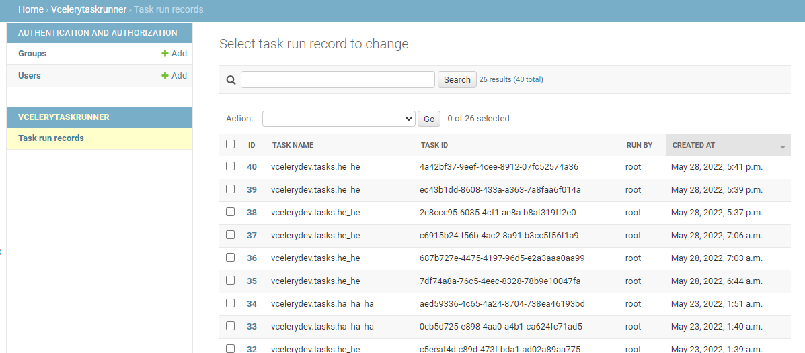

# Van's Celery Task Runner

This set of tools will present a UI to:
- search Celery tasks
- start Celery tasks with args and kwargs (as long as they can be expressed in JSON)
- Journaling of who ran what tasks when and with what arguments


Optional controls:

- Whitelisting task names to only surface a subset of the tasks
- Django permission control around who can see and run tasks


## Installation

- Install the package: `pip install vcelery-task-runner`
- Add into your project's `settings.py`:
  ```
  INSTALLED_APPS = [
      ...
      'rest_framework',
      'vcelerytaskrunner.apps.AppConfig',
  ]
  ```
  
  vcelery-task-runner uses the Django REST Library
- Also in `settings.py`, let **vcelery-task-runner** know your Celery app:
  ```
  # celery_app is a reference to your project's Celery app instance
  VCELERY_TASKRUN_CELERY_APP = celery_app
  ```
- Also in `settings.py`, set the maximum age of run records to keep around (more about this [below](#taskrunrecords)).
  ```
  VCELERY_TASK_RUN_RECORD_LONGEVITY = timedelta(weeks=52)  # Or however long you want to keep records of task runs
  ```

## Configuration

### Runnable Tasks

By default, all tasks are "runnable" in the UI. However, if you wan to restrict
visibility to only a subset of the tasks, add into the project's `settings.py`:

```
VCELERY_TASKRUN_RUNNABLE_TASKS = {
    "vcelerydev.tasks.he_he",  # full name of task (e.g. "vcelerydev/tasks.py::he_he)
}
```

If you set up an empty set, NOTHING will be runnable (quick way to disable the run operation):

```
VCELERY_TASKRUN_RUNNABLE_TASKS = {
}
```
### UI

There is a set of pages ready to list/search task by name and to run tasks. To add them
to you app, add these entries into your main `urls.py`:

```
from vcelerytaskrunner.views import TaskRunAPIView, TasksAPIView, TasksView, TaskRunFormView, TaskRunResultView

...

urlpatterns = [
    ...
    url('^vcelery/tasks/', TasksView.as_view(), name="vcelery-tasks"),
    url('^vcelery/task_run/', TaskRunFormView.as_view(), name="vcelery-task-run"),
    url('^vcelery/task_run_result/(?P<task_id>[\w-]+)/', TaskRunResultView.as_view(), name="vcelery-task-run-result"),

    url('^vcelery/api/tasks/', TasksAPIView.as_view(), name="vcelery-api-tasks"),
    url('^vcelery/api/task_run/', csrf_exempt(TaskRunAPIView.as_view()), name="vcelery-api-task-run")
    ....
]
```

The actual URL paths may vary according to your project's / app's needs. However, the name MUST be as shown because
there are code that looks up the views by name (e.g. `"vcelery-task-run"`), and they will fail if you don't use the
names shown here.

The view classes obviously have to be the ones shown. Although if you looked at the code and have done so carefully,
you may derive from the views to specialize them as needed.


### Permissions

By default, only staff users have access to the UI. To add more users to the UI:

- Add the permission `vcelerytaskrunner.view_taskrunrecord` to allow a user to view the initial page (listing of tasks).
- Add ALSO the permission `vcelerytaskrunner.add_taskrunrecord` to allow a user to run a runnable task.

You are free to use groups to set this up.

## TaskRunRecords

Each run of a task through the UI is recorded into the model `vcelerytaskrunner.models.TaskRunRecord`. 

There is a default admin model set up for it:



### Pruning old records

Since each run is recorded, over time this table will grow large. Therefore, the `VCELERY_TASK_RUN_RECORD_LONGEVITY`
setting is used to define the longevity of these records. 

Each time the **vcelerytaskrunner** app is initialized:
- a query is made to find `TaskRunRecord`s created before `datetime.utcnow() - VCELERY_TASK_RUN_RECORD_LONGEVITY`
- records older than this datetime **will be removed**.

If you don't explicitly define `VCELERY_TASK_RUN_RECORD_LONGEVITY` in your settings, the default value 
`timedelta(weeks=4)` will be used, meaning entries older than 4 weeks will be removed.

## TaskRunSignal

To be notified when a task is run, subscribe to the `TaskRunSignal` signal from `TaskRunner` from the module
`vcelerytaskrunner.services.task_runner`:

```
from vcelerytaskrunner.services.task_runner import TaskRunSignal, TaskRunner

...

@receiver(TaskRunSignal, sender=TaskRunner)
def task_run_listener(sender, **kwargs):
    """
    Example of a signal handler for task run events.
    """
    task_name = kwargs['task_name']
    task_id = kwargs['task_id']
    task_run_args = kwargs['args']
    task_run_kwargs = kwargs['kwargs']
    user = kwargs.get('user')

    logger.info(
        f"task_run_listener: task {task_name} (ID {task_id}) run by {user}"
        f" with args={task_run_args}, kwargs={task_run_kwargs}"
    )
```
